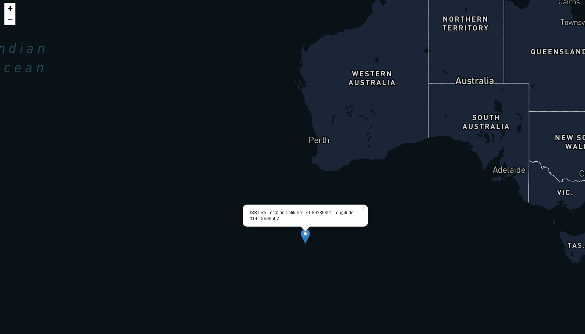

# ISS-Tracker
This project is implemented using Leaflet.js and Three.js
Courtesy of 3D model of International Space Station : solarsystem.nasa.gov 
THREE.js module comes under the node modules, you'll have to install those modules to run the code.

